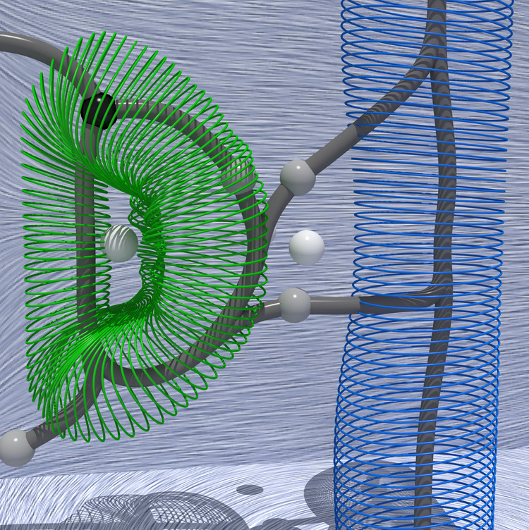

# Vortices in the magnetically-induced current density in LiH molecule studied through the lens of the Omega function


| | 
|:-:|
|<div style="width:500px"><b>An automatic approach based on Topological Data Analysis extracts axial (blue) and toroidal (green) vortices in magnetically-induced current density as specific sub-sets of the separatrices (gray curves) of the Morse-Smale complex of the Omega index.</b></div>|

## Pipeline description

This example illustrates (1) the calculation of the magnetically-induced current density (MICD) tensor in the LiH molecule in the [DIRAC](http://www.diracprogram.org/) software, followed by (2) the calculation of the Omega index with the [qcten](https://github.com/gosiao/qcten) script and (3) its subsequent topological analysis in the [TTK](https://topology-tool-kit.github.io/) software.


The first step involving quantum chemistry calculations aims to compute the MICD tensor and its gradient and export them on a 3D grid.


The purpose of the second step is a pointwise derivation of a scalar function from these tensor fields. In this case, the studied scalar field represents the so-called Omega index, used as an indicator of vortices in the first-order current density field. This step also involves translating data exported from [DIRAC](http://www.diracprogram.org/) in TXT to the VTI format favored by the [TTK](https://topology-tool-kit.github.io/) code. Simultaneously, it applies the resampling filter ("ResampleToImage") without changing the number of grid points or grid bounds.


The final step involves analyzing the Omega scalar field in the [TTK](https://topology-tool-kit.github.io/) software. It starts with extracting all critical point pairs, determining a persistence threshold for the salient pairs, and using this threshold to simplify the topology of the Omega scalar field. Then, the computation of the Morse-Smale complex of such simplified field results, among others, in the extraction of its one-dimensional separatrices. A subset of these separatrices connecting 2-saddles and maxima well captures the center lines of vortices. These can then be associated with axial and toroidal vortices in the MICD of the LiH molecule. Notable [TTK](https://topology-tool-kit.github.io/) filters employed in this analysis are the `PersistenceDiagram`, `TopologicalSimplification`, `MorseSmaleComplex`, and `PersistentGenerators`.


For more details on this analysis, please see the publication [on arXiv](https://arxiv.org/abs/2212.08690). All data files generated in this analysis are on [zenodo](https://doi.org/10.5281/zenodo.8223992). All links are [at the bottom of this page](#resources-and-additional-information).

Below, we describe these three steps in more detail.


## Quantum chemistry calculations

### Setup

The experimental geometry of LiH molecule from the [NIST database](https://cccbdb.nist.gov/exp2x.asp?casno=7580678&charge=0#NISTdiatomic and https://www.nist.gov/pml/diatomic-spectral-database) was used (R(Li-H) = 1.595 Angstrom).

The MICD tensor and its gradient were calculated analytically in the development version of the [DIRAC](http://www.diracprogram.org/) software (commit hash `2330f11`) with the Dirac-Coulomb Hamiltonian, the B3LYP exchange-correlation functional, and the def-TZVP basis set applied for both atoms. London atomic orbitals and the simple magnetic balance scheme were applied in response calculations. The densities were exported on the cube grid of 128 points in each Cartesian direction using the default visualization options in [DIRAC](http://www.diracprogram.org/).


### [DIRAC](http://www.diracprogram.org/) inputs

* Molecular geometry of LiH molecule in XYZ format (in Angstrom): [LiH.xyz](https://github.com/tda-qchem/tda-qchem-examples/tree/main/data/LiH_MICD/LiH.xyz)
* Input for a wave function optimization: [scf.inp](https://github.com/tda-qchem/tda-qchem-examples/tree/main/data/LiH_MICD/dirac/dc_b3lyp_def2tzvp/inputs/scf.inp)
* Input for calculations of the magnetic-field response (uses NMR shielding calculations): [prp.inp](https://github.com/tda-qchem/tda-qchem-examples/tree/main/data/LiH_MICD/dirac/dc_b3lyp_def2tzvp/inputs/prp.inp)
* Inputs for calculations of the components of the MICD tensor, composed of the elements of the current density vector induced by the magnetic field applied in 
    the "x"-direction ([jbx.inp](https://github.com/tda-qchem/tda-qchem-examples/tree/main/data/LiH_MICD/dirac/dc_b3lyp_def2tzvp/inputs/visgrid_cube_128/jbx.inp)), 
    the "y"-direction ([jby.inp](https://github.com/tda-qchem/tda-qchem-examples/tree/main/data/LiH_MICD/dirac/dc_b3lyp_def2tzvp/inputs/visgrid_cube_128/jby.inp)), and 
    the "z"-direction ([jbz.inp](https://github.com/tda-qchem/tda-qchem-examples/tree/main/data/LiH_MICD/dirac/dc_b3lyp_def2tzvp/inputs/visgrid_cube_128/jbz.inp))
* Inputs for calculations of the components of the gradient of the MICD tensor, composed of the elements of the gradient of the current density vector induced by the magnetic field applied in 
    the "x"-direction ([gradjbx.inp](https://github.com/tda-qchem/tda-qchem-examples/tree/main/data/LiH_MICD/dirac/dc_b3lyp_def2tzvp/inputs/visgrid_cube_128/gradjbx.inp)), 
    the "y"-direction ([gradjby.inp](https://github.com/tda-qchem/tda-qchem-examples/tree/main/data/LiH_MICD/dirac/dc_b3lyp_def2tzvp/inputs/visgrid_cube_128/gradjby.inp)), and 
    the "z"-direction ([gradjbz.inp](https://github.com/tda-qchem/tda-qchem-examples/tree/main/data/LiH_MICD/dirac/dc_b3lyp_def2tzvp/inputs/visgrid_cube_128/gradjbz.inp))

### [DIRAC](http://www.diracprogram.org/) outputs

* Files with exported elements of the MICD tensor and its gradient on a grid in TXT format; these are also available on [zenodo](https://doi.org/10.5281/zenodo.8223992).
* [DIRAC](http://www.diracprogram.org/) text output files, available in [the repository](https://github.com/tda-qchem/tda-qchem-examples/tree/main/data/LiH_MICD/dirac/dc_b3lyp_def2tzvp/outputs) and on [zenodo](https://doi.org/10.5281/zenodo.8223992).

### Execution

* Below, we assume that the `pam` script of [DIRAC](http://www.diracprogram.org/) is available in `$PATH`.

* Step 1. Wave function optimization:

```
mol=LiH.xyz
inp_scf=scf.inp
pam --inp=$inp_scf --mol=$mol --outcmo
```

* Step 2. Response calculations:

```
mol=LiH.xyz
inp_prp=prp.inp
pam --inp=$inp_prp --mol=$mol --incmo --get="DFCOEF=DFCOEF.smb TBMO PAMXVC"
```


* Step 3. Calculations and export of real-space densities,

    * involving the elements of the MICD tensor, on an example of the `jbx.inp` file:

      ```
      mol=LiH.xyz
      vis=jbx
      inp_vis=$vis.inp
      pam --inp=$inp_vis --mol=$mol --put="DFCOEF.smb=DFCOEF TBMO PAMXVC" --get="plot.3d.vector=$vis.txt"
      ```

    * involving the elements of the gradient of the MICD tensor, on an example of the `gradjbx.inp` file:

      ```
      mol=LiH.xyz
      vis=gradjbx
      inp_vis=$vis.inp
      pam --inp=$inp_vis --mol=$mol --put="DFCOEF.smb=DFCOEF TBMO PAMXVC" --get="plot.3d.tensor=$vis.txt"
      ```

    * analogous computations should be done with the `jby.inp` file (please change of `vis=jbx` to `vis=jby`) and the `jbz.inp` file (please change `vis=jbx` to `vis=jby`),
    * analogous computations should be done with the `gradjby.inp` file (please change of `vis=gradjbx` to `vis=gradjby`) and the `gradjbz.inp` file (please change `vis=gradjbx` to `vis=gradjby`).


## Calculation of scalar functions for the topological data analysis

### Inputs

* Data exported from [DIRAC](http://www.diracprogram.org/):
    * The "x"/"y"/"z" elements of the current density vector field induced by the magnetic field applied in the "x" direction are in the 4th/5th/6th-column of the `jbx.txt` file.
    * The "x"/"y"/"z" elements of the current density vector field induced by the magnetic field applied in the "y" direction are in the 4th/5th/6th-column of the `jby.txt` file.
    * The "x"/"y"/"z" elements of the current density vector field induced by the magnetic field applied in the "z" direction are in the 4th/5th/6th-column of the `jbz.txt` file.
    * The "x"/"y"/"z" elements of the gradient of the current density vector field induced by the magnetic field applied in the "z" direction are in the `gradjbx.txt` file, starting from the 4th column).
    * In all TXT files exported from [DIRAC](http://www.diracprogram.org/), first three columns refer to the "x"/"y"/"z"-coordinates of grid vertices.

### Execution

* Below, we assume that the conda environment with `qcten` installed (see Installation instructions to [qcten](https://github.com/gosiao/qcten/blob/main/README.md)) is activated. In this guilde, we use the `qcten_env` name for this environment. The `qcten` script calculates the Omega function from the DIRAC data (here: available in raw text files) and exports it in the VTI format.
  To reproduce this step:

  * prepare the run script and the input file for `qcten` (sample `run.py` and `bz_omega_wz.inp` are available on [zenodo](https://doi.org/10.5281/zenodo.8223992)).
  * if needed, adapt the paths to DIRAC data (`jb*.txt` and `gradjb*.txt` files) in the input file, and execute `python run.py`
  * analogous computations can be done on data corresponding to the perturbing magnetic field applied in the "x"- and "y"-directions (to get the Omega function for the "Bx" and "By" fields)

### Outputs

The above Python script produces the `start_data_omega_bz.vti` file, which can also be found in [the repository](https://github.com/tda-qchem/tda-qchem-examples/tree/main/data/LiH_MICD/vti/start_data_omega_bz.vti) and on [zenodo](https://doi.org/10.5281/zenodo.8223992). 


## Topological Data Analysis

### Inputs

* It may help to mark the positions of the Li and H nuclei on the plots; for this purpose, the molecular geometry of the LiH molecule in CSV format (in atomic units) is available in the [LiH.csv](https://github.com/tda-qchem/tda-qchem-examples/tree/main/data/LiH_MICD/LiH.csv) file.

* MICD-related data in VTI format:

    * Omega function derived from the magnetically-induced current density vector corresponding to the perturbation of the magnetic field applied perpendicularly to the Li-H bond: `start_data_omega_bz.vti` file in [the repository](https://github.com/tda-qchem/tda-qchem-examples/tree/main/data/LiH_MICD/vti/start_data_omega_bz.vti) and on [zenodo](https://doi.org/10.5281/zenodo.8223992); data description:
        * `omega_bz` - corresponds to Omega function calculated for the magnetic field applied perpendicularly to the Li-H bond ("bz");
        * `bz_wz` - corresponds to the "z"-component of the curl of the current density vector induced by the magnetic field applied perpendicularly to the Li-H bond ("bz"); it is a zz-component of the vorticity tensor.

    * The elements of the magnetically-induced current density vector corresponding to the perturbation of the magnetic field applied perpendicularly to the Li-H bond are on the `start_data_bz.vti` file in [the repository](https://github.com/tda-qchem/tda-qchem-examples/tree/main/data/LiH_MICD/vti/start_data_bz.vti) and on [zenodo](https://doi.org/10.5281/zenodo.8223992); the "x"/"y"/"z" elements of this vector are marked as  `bz_jx`, `bz_jy`, `bz_jz`, respectively.

    * Additionally, on [zenodo](https://doi.org/10.5281/zenodo.8223992), we also share the VTI file which contains all the elements of the full MICD tensor (`start_data_jb_tensor.vti` file).
    
### ParaView

To reproduce the images and to explore the TDA pipeline, go to the root directory of [this repository](https://github.com/tda-qchem/tda-qchem-examples) and enter the following command:

``` bash
paraview --state=pvsm/lih.pvsm
```

### Python code
The following Python code reproduces the main analysis pipeline in batch mode.

``` python  linenums="1"
--8<-- "python/lih.py"
```

To run the above Python script, go to the root directory of 
[this repository](https://github.com/tda-qchem/tda-qchem-examples) and enter the following command:

``` bash
pvpython python/lih.py
```

### Outputs
The above Python script produces the following outputs:

- `axialVortex.vtu`: the geometry of the axial vortex in VTU file format (to be
  visualized with ParaView, change the extension to `csv` instead of `vtu` in the above script to export to an ASCII file instead).
- `toroidalVortex.vtu`: the geometry of the toroidal vortex in VTU file format (to be visualized with ParaView, change the extension to `csv` instead of `vtu` in the above script to export to an ASCII file instead).

## Resources and additional information

* [Prerequisites](https://tda-qchem.github.io/tda-qchem-examples/)
* [DIRAC](http://www.diracprogram.org/)
* [TTK](https://topology-tool-kit.github.io/)
* [qcten](https://github.com/gosiao/qcten)

* The calculations and export of the magnetically-induced current density are also discusssed in [the official DIRAC tutorial](http://www.diracprogram.org/doc/release-22/tutorials/visual/general/tutorial.html#densities-and-currents-induced-by-a-magnetic-field).

* Related data: the publication on [arXiv](https://arxiv.org/abs/2212.08690) and its [1-page summary](), data files generated in this analysis on [zenodo](https://doi.org/10.5281/zenodo.8223992).

* To fully reproduce the results reported in the publication, please check [this link]().
* To fully reproduce the publication, please check [this link]().
